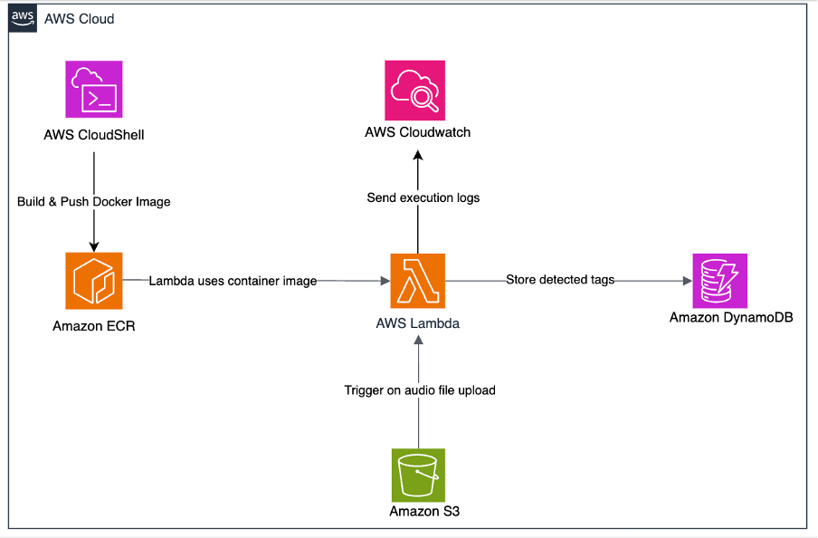

# BirdTag – Audio Tagging Pipeline (AWS Lambda + BirdNET)

This project implements an **event-driven, serverless bird audio tagging pipeline** using AWS services and the [BirdNET Analyzer](https://github.com/kahst/BirdNET-Analyzer) model. It was developed as part of a cloud computing project at Monash University.

When an audio file (e.g., `.wav`) is uploaded to an S3 bucket, a Lambda function is triggered to:
1. Download the BirdNET model and code
2. Convert audio if needed using FFmpeg
3. Run bird species detection via BirdNET
4. Store results (species tags) in DynamoDB

---

## 🔧 Technologies Used

- **AWS Lambda** – Serverless compute engine for on-demand processing  
- **Amazon S3** – Storage for user-uploaded audio and model/code packages  
- **Amazon ECR** – Container image hosting (for Lambda runtime)  
- **Amazon DynamoDB** – Serverless NoSQL database for storing tag results  
- **FFmpeg** – For converting audio formats to `.wav`  
- **Python** – Backend logic and BirdNET integration  
- **BirdNET Analyzer** – ML model for bird species recognition from audio  

---

## 📦 Model & Code Sources

This pipeline is powered by the open-source [BirdNET Analyzer](https://github.com/kahst/BirdNET-Analyzer) developed by the Cornell Lab of Ornithology.

- 🔗 **Official GitHub Repository**:  
  [https://github.com/kahst/BirdNET-Analyzer](https://github.com/kahst/BirdNET-Analyzer)

- 📥 **Original model files (v2.4)**:  
  Download from the [BirdNET Release Page](https://birdnet-team.github.io/BirdNET-Analyzer/models.html)

---

## 📊 Architecture Diagram

  
Figure: Audio Tagging Pipeline using AWS Lambda and BirdNET

---

## 🚀 How It Works

1. A user uploads a `.wav` or `.flac` file to an S3 bucket.
2. This triggers a Lambda function via `ObjectCreated` event.
3. Lambda:
   - Downloads model and code from S3
   - Converts audio (if needed) to `.wav` using FFmpeg
   - Runs BirdNET using `subprocess.run()`
   - Parses CSV output to extract `"Scientific name"` values
   - Stores extracted tags in DynamoDB along with metadata
4. CloudWatch is used to monitor logs and detect failures.

---

## ✅ Features

- Works with `.wav` and auto-converts `.flac` to `.wav`
- Uses temporary `/tmp` directory for runtime storage
- Handles model/code unpacking dynamically inside Lambda
- Designed for serverless, cost-efficient processing

---

## 🧑‍💻 Author

**Alicia Zhao**  
Contributed the audio tagging pipeline for FIT5225 Assignment 3  
Part of the team project: *BirdTag – An AWS-powered Serverless Media Storage System with Advanced Tagging Capabilities*

---

## 📌 Notes

- The pipeline extracts only the presence of species (1 per name), not frequency or confidence scores.
- You can customize to include confidence filtering or timestamp tagging.
- Container image was built and deployed via AWS CloudShell and ECR.

---

## 📜 License & Attribution

This project is for academic and educational purposes only.  
It uses the [BirdNET Analyzer](https://github.com/kahst/BirdNET-Analyzer), developed and maintained by the [K. Heinicke & Cornell Lab of Ornithology](https://www.birds.cornell.edu/).  
All credits for the model architecture and training data go to the original authors.

